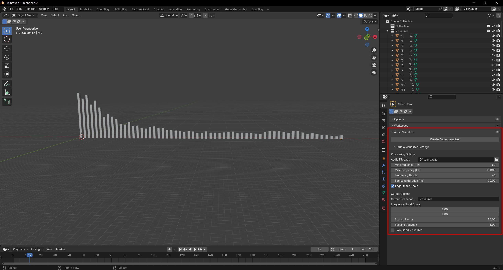

# AudioVis

Generate animated audio visualization from input file in Blender.

## Installation

To install the add-on, download the audiovis-x-y.zip file attached to the latest release and install it as a regular blender add-on (User Preferences -> Addons -> Install from file).

## Generating Visualization

A new panel, "Audio Visualizer" is created in `Properties -> Tool` after add-on is enabled in preferences.

Visualizations can be created after specifying the "Audio File Path" property as the path to an audio file and then pressing the "Create Audio Visualizer" button.
Generation of animation data may take a while (depending on processing options), and during this time Blender won't be responsive.

All audio formats specified [here](https://docs.blender.org/manual/en/latest/files/media/video_formats.html#ffmpeg-audio-codecs) are supported.

Generated animation data can be further processed, e.g., with geometry nodes, to create better visualizers.

### Settings

Processing options:
- "Audio File Path" - Path to the audio file to process
- "Min Frequency [Hz]" - Minimum frequency of the signal to visualize
- "Max Frequency [Hz]" - Maximum frequency of the signal to visualize
- "Frequency Bands" - Number of frequency bands (number of generated cubes) for visualization
- "Sampling duration [ms]" - Duration of sampling time for a single step (the shorter the duration, the faster changes can be visualized)
- "Logarithmic Scale" - Use logarithmic scale for frequency band height

Output Options:
- "Output Collection Name" - Name of collection for generated objects
- "Frequency Band Scale" - X and Y scales of the frequency band (X and Y scales of generated cubes)
- "Scaling Factor" - Multiplier for frequency band height
- "Spacing Between" - Amount of space between frequency bands
- "Two Sided Visualizer" - Scale the frequency band in both directions